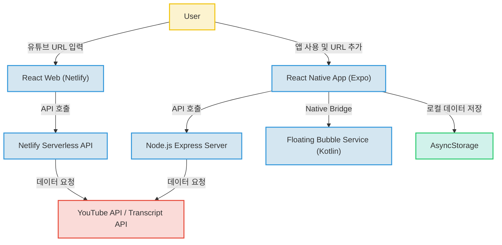

# Unknown Project (YouTube 자막 및 메타데이터 추출 플랫폼)

유튜브 영상의 URL을 분석하여 자막 정보와 메타데이터를 추출하고, 이를 웹과 모바일 환경에서 효율적으로 관리할 수 있는 멀티 플랫폼 서비스입니다. React 기반의 웹 UI와 Android 네이티브 기능을 활용한 React Native 앱을 통해 사용자에게 최적화된 경험을 제공합니다.

## 🚀 프로젝트 소개
이 프로젝트는 유튜브 영상에서 유의미한 데이터(자막, 제목, 설명 등)를 추출하여 학습이나 정보 정리 등에 활용할 수 있도록 돕는 도구입니다. 백엔드 서버와 서버리스 API를 혼합한 하이브리드 아키텍처를 채택하고 있으며, 특히 안드로이드 환경에서는 네이티브 모듈을 개발하여 화면 위에 항상 떠 있는 '플로팅 버블' 기능을 구현한 것이 특징입니다.

## ✨ 주요 기능
- **유튜브 데이터 추출**: 유튜브 URL을 통해 영상의 자막 및 메타데이터를 실시간으로 파싱합니다.
- **멀티 플랫폼 지원**: React 기반의 웹 환경과 React Native 기반의 모바일 환경을 모두 지원합니다.
- **안드로이드 플로팅 버블**: 앱이 백그라운드에 있어도 화면 위에 UI를 띄워 제어할 수 있는 네이티브 기능을 제공합니다. (Android 전용)
- **데이터 로컬 저장**: 모바일 환경에서 추출한 영상 데이터를 영구적으로 보관할 수 있는 스토리지 기능을 포함합니다.
- **서버리스 API**: Netlify Functions를 활용하여 별도의 서버 관리 없이도 자막 데이터를 조회할 수 있는 유연한 API 구조를 갖추고 있습니다.

## 📂 프로젝트 구조 (추정)
```text
.
├── be/                 # Node.js Express 백엔드 서버
├── fe/                 # React 웹 프론트엔드 및 Netlify 서버리스 함수
├── app/                # React Native 모바일 앱 (Expo)
│   ├── android/        # 안드로이드 네이티브 코드 (Kotlin)
│   └── src/            # 모바일 앱 소스 코드 및 유틸리티
└── README.md
```

## 🔍 핵심 파일 설명
- **`be/index.js`**: YouTube URL 파싱 및 메타데이터/자막 추출 API를 제공하는 Express 서버의 핵심 로직을 담당합니다.
- **`app/AppInner.js`**: 모바일 앱의 탭 네비게이션을 구성하며, 안드로이드 네이티브 모듈과 통신하여 플로팅 버튼 이벤트를 처리합니다.
- **`app/android/app/src/main/java/.../FloatingBubbleService.kt`**: 안드로이드 시스템 서비스로, 화면 위에 항상 떠 있는 UI 요소를 구현한 네이티브 코드입니다.
- **`fe/api/transcript.js`**: Netlify 플랫폼에서 실행되는 서버리스 함수로, 백엔드 서버 없이도 자막 데이터를 가져오는 경량 로직을 담당합니다.
- **`app/src/utils/storage.js`**: 모바일 환경에서 `AsyncStorage` 등을 활용해 영상 데이터를 영구적으로 저장하기 위한 스토리지 로직입니다.

## 🛠 기술 스택

### Frontend
- **React 19.1.0**: 최신 기능을 활용한 선언적인 UI 및 효율적인 컴포넌트 기반 개발.
- **React Native 0.79.2**: 하나의 코드베이스로 모바일 앱을 구축하여 개발 효율성 극대화.
- **Expo 53.0.9**: 복잡한 설정 없이 빠른 모바일 개발 및 배포 환경 구성.
- **Bootstrap 5.3.6**: 반응형 웹 디자인을 쉽고 일관되게 구현.
- **React Navigation 7.1.10**: 모바일 환경에 최적화된 매끄러운 화면 전환 설계.

### Backend
- **Node.js Express 5.1.0**: 비동기 I/O를 활용한 빠르고 가벼운 RESTful API 서버 구축.
- **Axios 1.9.0**: 외부 API 연동의 안정성을 확보하기 위한 HTTP 클라이언트.
- **Youtube-transcript-api 2.0.4**: 유튜브 자막 데이터를 객체 형태로 간편하게 획득.
- **Netlify Functions**: 서버 관리 부담을 줄이는 클라우드 기반 서버리스 아키텍처.

### DevOps & Native
- **Netlify**: CI/CD 자동화를 통해 코드 수정 시 즉시 서비스 반영.
- **Kotlin/Android SDK**: 네이티브 모듈(Floating Bubble) 구현을 통해 플랫폼 특화 기능 제어.

## 🏗 시스템 아키텍처
본 시스템은 웹(React)과 모바일(React Native)이 공존하며, 독립형 서버와 서버리스 API가 혼합된 하이브리드 구조를 가집니다.



## ⚙️ 실행 방법
*상세 정보 부족으로 인해 기본적인 실행 단계만 기재하며, 실제 환경에 따른 추가 작성이 필요합니다.*

### Backend
1. `cd be`
2. `npm install`
3. `node index.js`

### Web Frontend
1. `cd fe`
2. `npm install`
3. `npm start`

### Mobile App
1. `cd app`
2. `npm install`
3. `npx expo start`

## 💡 기술 선택 이유
- **React & React Native**: 웹과 모바일의 코드 재사용성을 높이고 생산성을 극대화하기 위해 선택했습니다.
- **Netlify Functions**: 트래픽이 적거나 단순한 기능(자막 추출)에 대해 서버 비용을 절감하고 관리 효율을 높였습니다.
- **Kotlin Native Module**: React Native에서 기본 제공하지 않는 안드로이드 시스템 레벨 기능(Floating UI)을 구현하기 위해 네이티브 브릿지를 활용했습니다.
- **Express**: 가벼운 서버 구조를 선호하여 빠르게 API 기능을 배포하고자 사용했습니다.

## 📈 개선 방향
- **데이터 동기화 강화(추정)**: 현재 웹과 모바일이 독립적인 저장소를 사용하는 것으로 보이나, 향후 통합 DB(Firebase 등)를 도입하여 플랫폼 간 데이터 동기화가 필요합니다.
- **API 중복성 정리(추정)**: Express 서버와 Netlify Functions에 중복 구현된 로직을 단일화하여 유지보수성을 높일 수 있습니다.
- **보안 강화**: API 키 및 환경 변수 노출 방지를 위한 보안 관리를 강화할 예정입니다.